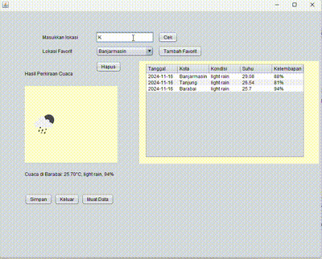

# Aplikasi Cek Cuaca Sederhana

Aplikasi Cek Cuaca Sederhana adalah aplikasi berbasis Java yang memungkinkan pengguna untuk memeriksa cuaca terkini di berbagai kota di seluruh dunia. Aplikasi ini memanfaatkan API OpenWeatherMap untuk mendapatkan informasi cuaca dan menampilkannya kepada pengguna. Pengguna dapat menyimpan data cuaca yang diperoleh dan menambahkannya ke dalam daftar kota favorit.

## Keunggulan Aplikasi

- **Pemeriksaan Cuaca Secara Langsung**: Mengambil data cuaca terkini dari API OpenWeatherMap dan menampilkan informasi suhu, kondisi cuaca, dan kelembapan di kota yang dipilih.
- **Daftar Kota Favorit**: Pengguna dapat menambahkan kota ke daftar favorit dan memilihnya dari combo box untuk memeriksa cuaca dengan mudah.
- **Penyimpanan dan Pemuatan Data Cuaca**: Menyediakan fitur untuk menyimpan data cuaca ke file CSV dan memuat data cuaca yang tersimpan dari file.
- **Tampilan Antarmuka Sederhana**: Dilengkapi dengan antarmuka pengguna berbasis Java Swing yang mudah digunakan dan informatif.

## Pembuat Aplikasi

Salsa Alya Istiqamah - 2210010089 - Tugas 6

## Fitur

Aplikasi Cek Cuaca Sederhana menawarkan fitur-fitur berikut:

1. **Pemeriksaan Cuaca Secara Langsung**  
   Pengguna dapat memasukkan nama kota dan mendapatkan data cuaca terkini, termasuk suhu, kelembapan, dan deskripsi kondisi cuaca. Aplikasi juga menampilkan ikon cuaca sesuai dengan kondisi saat itu.

2. **Daftar Kota Favorit**  
   Pengguna dapat menambahkan kota ke dalam daftar favorit dan memilihnya dari combo box untuk memeriksa cuaca dengan cepat. Kota favorit disimpan untuk memudahkan pemeriksaan cuaca di lain waktu.

3. **Penyimpanan dan Pemuatan Data Cuaca**  
   Data cuaca yang diperoleh dapat disimpan dalam format CSV untuk referensi di masa depan. Selain itu, pengguna dapat memuat data cuaca yang telah disimpan sebelumnya.

4. **Antarmuka Pengguna yang User-Friendly**  
   Aplikasi ini menggunakan Java Swing untuk menyajikan antarmuka yang intuitif dengan elemen-elemen yang jelas, seperti tombol untuk memeriksa cuaca, menyimpan data, dan memuat data cuaca.

5. **Fitur Hapus Kota Favorit**  
   Pengguna dapat menghapus kota dari daftar favorit jika sudah tidak ingin memeriksa cuaca di kota tersebut lagi.

6. **Tabel Cuaca**  
   Aplikasi ini menyediakan tabel yang menampilkan riwayat cuaca kota yang telah dipilih, lengkap dengan tanggal, kondisi cuaca, suhu, dan kelembapan.

## Cara Menjalankan

1. Clone repositori ini ke komputer Anda atau unduh sebagai file ZIP.
2. Buka proyek di IDE pilihan Anda (misalnya, IntelliJ IDEA atau Eclipse).
3. Pastikan Anda sudah mengatur JDK dan mengimpor dependensi yang dibutuhkan.
4. Jalankan kelas Tugas6 untuk memulai aplikasi.

## Demo

